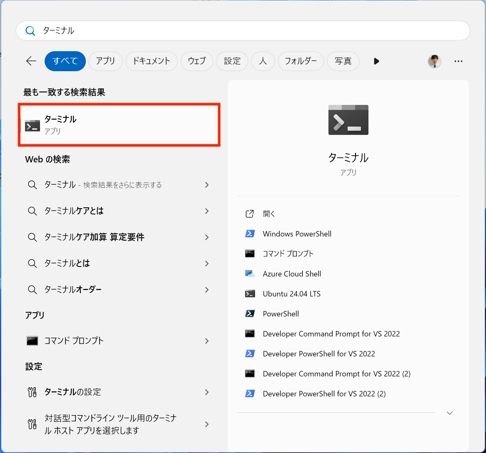

# **環境構築**
## **Python**
### **Pythonインストーラーをダウンロード**
[Python公式ダウンロード](https://www.python.org/downloads/)

### **Pythonインストール**


### **Pythonがインストールされたことを確認**
- windows 検索ボタンでターミナルと検索
    

- ターミナルを開きコマンドを押す
    ```
    python --version
    ```
    
	Python 3.xx.xx のようにpythonのバージョンが返ってくればOK
