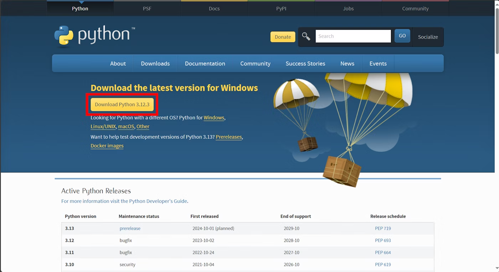
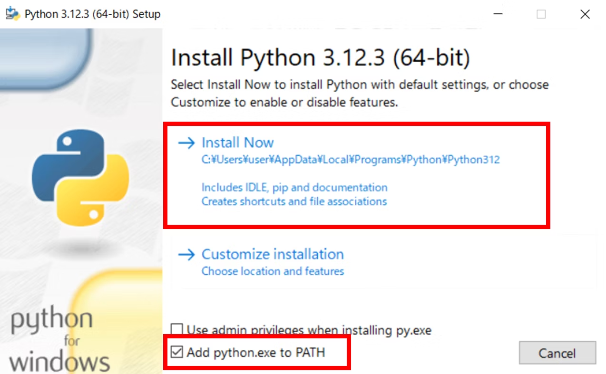

# 環境構築
## Python
### Pythonインストーラーをダウンロード
[Python公式ダウンロード](https://www.python.org/downloads/)

### Pythonインストール



### Pythonがインストールされたことを確認
- windows 検索ボタンでターミナルと検索
    

- ターミナルを開きコマンドを押す
    ```
    python --version
    ```
    
	Python 3.xx.xx のようにpythonのバージョンが返ってくればOK
